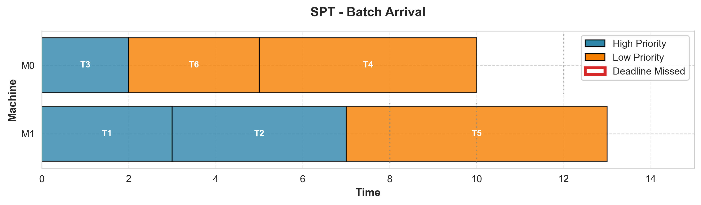

# Scheduling Simulator with Deadline Pressure Estimation

> A comprehensive discrete-event scheduling simulator for comparing greedy scheduling algorithms with deadline awareness

[](https://www.python.org/downloads/)
[](https://opensource.org/licenses/MIT)

## Overview

Welcome! This project implements and compares four scheduling algorithms for parallel machine environments with hard deadlines. Whether you're learning about scheduling theory, researching greedy algorithms, or exploring deadline-aware scheduling, this simulator provides a clean, extensible framework for experimentation.

**What makes this project special:**
- 🎯 **Minimal dependencies** - Core simulator uses only Python standard library
- 📊 **Publication-quality visualizations** - Gantt charts, performance comparisons, and statistical plots
- 🧪 **Comprehensive test suite** - 14 carefully designed scenarios from simple to extreme
- 🔬 **Novel DPE algorithm** - Deadline Pressure Estimation with configurable parameters
- 📈 **Metrics collection** - Automatic tracking of success rates, makespan, response times

---

## Table of Contents

- [Features](#features)
- [Installation](#installation)
- [Quick Start](#quick-start)
- [Algorithms Explained](#algorithms-explained)
- [Usage Guide](#usage-guide)
- [Project Structure](#project-structure)
- [Results and Visualizations](#results-and-visualizations)
- [Advanced Usage](#advanced-usage)
- [Contributing](#contributing)
- [Acknowledgments](#acknowledgments)
- [License](#license)

---

## Features

### Core Capabilities
- ✅ **4 Scheduling Algorithms**: SPT, EDF, Priority-First, and DPE (with α tuning)
- ✅ **Parallel Machine Scheduling**: Support for multiple machines with load balancing
- ✅ **Hard Deadlines**: All tasks have explicit deadlines and priority levels
- ✅ **Comprehensive Metrics**: Success rates, makespan, response time, waiting time
- ✅ **14 Test Scenarios**: Organized into simple, challenge, and extreme categories

### Visualization System
- 📊 **Gantt Charts**: Visual timeline of task scheduling on machines
- 📈 **Performance Comparisons**: Side-by-side algorithm performance with traffic light colors
- 🎨 **Publication Quality**: 300 DPI output ready for reports and presentations
- 🔥 **Statistical Analysis**: Box plots, heatmaps, and distribution visualizations

### Experiment Framework
- 🧪 **Automated Experiments**: Run all scenarios across all algorithms with one command
- 💾 **CSV Export**: Results exported for analysis in Excel, Google Sheets, or pandas
- 📋 **Comparison Tables**: Automatic generation of performance comparison tables
- 🎯 **Focused Testing**: Run specific scenarios or algorithms individually

---

## Installation

### Prerequisites
- Python 3.7 or higher
- pip (Python package manager)

### Step 1: Clone the Repository
```bash
git clone <repository-url>
cd simulator
```

### Step 2: (Optional) Create Virtual Environment
```bash
python3 -m venv .venv
source .venv/bin/activate  # On Windows: .venv\Scripts\activate
```

### Step 3: Install Dependencies

**For core simulator only (no dependencies needed!):**
```bash
# Core simulator works out of the box!
python3 simple_simulator.py
```

**For visualizations (requires matplotlib and pandas):**
```bash
pip install matplotlib pandas
```

That's it! The core scheduling simulator has **zero external dependencies** and uses only Python's standard library.

---

## Quick Start

### Run a Simple Example

```python
from simple_simulator import Task, Priority, SPT_Scheduler, EDF_Scheduler

# Define tasks: Task(id, arrival, processing_time, priority, deadline)
tasks = [
    Task(1, 0, 3, Priority.HIGH, 10),
    Task(2, 0, 2, Priority.HIGH, 12),
    Task(3, 1, 4, Priority.LOW, 15),
]

# Run SPT scheduler with 2 machines
scheduler = SPT_Scheduler(tasks, num_machines=2)
scheduler.run()

# Check results
for task in tasks:
    status = "✓" if task.meets_deadline() else "✗"
    print(f"Task {task.id}: {status} (completed at {task.completion_time})")
```

### Run All Experiments

```bash
python3 experiment_runner.py
```

This will:
1. Run all 14 scenarios (simple, challenge, extreme)
2. Test all 4 algorithms with 6 configurations
3. Export results to `results/comprehensive_results.csv`
4. Print comparison tables to console

Expected runtime: ~10-15 seconds

### Generate Visualizations

```bash
python3 visualizations.py
```

This creates publication-quality charts in the `visualizations/` folder:
- 16 Gantt charts (4 scenarios × 4 algorithms)
- Performance comparison charts
- Success rate visualizations
- DPE deadline pressure plots

Expected runtime: ~30-60 seconds

---

## Algorithms Explained

This project implements four scheduling algorithms. Here's what you need to know about each:

### 1. SPT (Shortest Processing Time)
**Strategy**: Always schedule the task with the shortest processing time first.

**Strengths:**
- ✅ Minimizes average waiting time
- ✅ Simple and fast to compute
- ✅ Works well when all tasks have similar deadlines

**Weaknesses:**
- ❌ Completely ignores deadlines
- ❌ Can miss urgent tasks with longer processing times
- ❌ Poor performance when deadlines vary significantly

**Use when:** Processing time is the primary concern, not deadlines.

---

### 2. EDF (Earliest Deadline First)
**Strategy**: Always schedule the task with the earliest deadline first.

**Strengths:**
- ✅ Optimal for single-machine scheduling (maximizes deadline satisfaction)
- ✅ Deadline-aware by design
- ✅ Works well with varied deadline distributions

**Weaknesses:**
- ❌ Ignores processing time completely
- ❌ Can schedule long tasks when short urgent tasks exist
- ❌ Not optimal for parallel machines

**Use when:** Deadlines are critical and task durations are similar.

---

### 3. Priority-First
**Strategy**: Always schedule HIGH priority tasks before LOW priority tasks.

**Strengths:**
- ✅ Guarantees high-priority tasks are attempted first
- ✅ Simple priority-based scheduling
- ✅ Useful when priority levels represent importance

**Weaknesses:**
- ❌ Can cause starvation of low-priority tasks
- ❌ Ignores both deadlines and processing times
- ❌ Poor utilization if high-priority tasks keep arriving

**Use when:** Task priority is more important than deadlines or efficiency.

---

### 4. DPE (Deadline Pressure Estimation) - **Novel Algorithm**
**Strategy**: Balance deadline urgency with task priority using a configurable parameter α.

**Formula:**
```
For each task t at time T:
  deadline_pressure = (T - arrival_time) / (deadline - arrival_time)

If deadline_pressure >= α:
  Schedule by deadline urgency (EDF-like)
Else:
  Schedule by priority (Priority-First-like)
```

**Parameters:**
- `α = 0.5`: Switches to deadline focus earlier (more aggressive)
- `α = 0.7`: **Recommended** - Good balance for most scenarios
- `α = 0.9`: Waits longer before prioritizing deadlines (more conservative)

**Strengths:**
- ✅ Adaptive algorithm that combines priority and deadline awareness
- ✅ Tunable via α parameter for different workload characteristics
- ✅ Prevents both priority starvation and deadline misses
- ✅ Often outperforms baseline algorithms in mixed workloads

**Weaknesses:**
- ❌ More complex than baseline algorithms
- ❌ Requires tuning α for optimal performance
- ❌ Can underperform specialists (SPT/EDF) in their ideal scenarios

**Use when:** You have mixed priorities and tight deadlines requiring balance.

---

## Usage Guide

### Creating Custom Scenarios

```python
from simple_simulator import Task, Priority

# Create your own task set
my_tasks = [
    # Task(id, arrival_time, processing_time, priority, deadline)
    Task(1, 0, 5, Priority.HIGH, 15),
    Task(2, 2, 3, Priority.LOW, 20),
    Task(3, 5, 2, Priority.HIGH, 10),
]
```

### Running Different Algorithms

```python
from simple_simulator import (
    SPT_Scheduler,
    EDF_Scheduler,
    PriorityFirst_Scheduler,
    DPE_Scheduler
)

# Test different algorithms
algorithms = [
    SPT_Scheduler(tasks, num_machines=2),
    EDF_Scheduler(tasks, num_machines=2),
    PriorityFirst_Scheduler(tasks, num_machines=2),
    DPE_Scheduler(tasks, num_machines=2, alpha=0.7),
]

for scheduler in algorithms:
    scheduler.run()
    print(f"{scheduler.__class__.__name__}: {calculate_metrics(scheduler.tasks)}")
```

### Tuning DPE Alpha Parameter

```python
# Test different alpha values
alphas = [0.5, 0.7, 0.9]

for alpha in alphas:
    tasks_copy = copy.deepcopy(original_tasks)
    scheduler = DPE_Scheduler(tasks_copy, num_machines=2, alpha=alpha)
    scheduler.run()

    success_rate = calculate_success_rate(tasks_copy)
    print(f"α={alpha}: {success_rate:.1f}% success rate")
```

### Analyzing Results

The experiment runner calculates comprehensive metrics:

```python
from experiment_runner import ExperimentRunner

runner = ExperimentRunner()
metrics = runner.run_experiment(scenario, "SPT", SPT_Scheduler)

# Available metrics:
# - Total Tasks
# - High/Low Priority Task counts
# - Deadline success rates (overall, high priority, low priority)
# - Makespan (total completion time)
# - Average response time
# - Average waiting time
```

---

## Project Structure

```
simulator/
│
├── simple_simulator.py          # Core scheduling algorithms and simulator
│   ├── Task class
│   ├── Priority enum
│   ├── SPT_Scheduler
│   ├── EDF_Scheduler
│   ├── PriorityFirst_Scheduler
│   └── DPE_Scheduler
│
├── experiment_runner.py         # Comprehensive experiment framework
│   ├── ExperimentRunner class
│   ├── Metrics calculation
│   └── CSV export functionality
│
├── simple_scenarios.py          # 4 basic validation scenarios
├── challenge_scenarios.py       # 5 challenging test cases
├── extreme_scenarios.py         # 5 stress test scenarios
│
├── visualizations.py            # Publication-quality chart generation
│   ├── SchedulingVisualizer class
│   ├── Gantt chart generation
│   ├── Performance comparisons
│   └── Statistical plots
│
├── results/                     # Experimental results (CSV files)
│   └── comprehensive_results.csv
│
└── visualizations/              # Generated charts (PNG files)
    ├── *_gantt.png             # Gantt charts for each scenario
    ├── makespan_comparison_detailed.png
    └── Other performance visualizations
```

### File Descriptions

| File | Purpose | Dependencies |
|------|---------|--------------|
| `simple_simulator.py` | Core scheduling logic | None (stdlib only) |
| `experiment_runner.py` | Run experiments and collect metrics | simple_simulator, scenario files |
| `*_scenarios.py` | Test scenario definitions | simple_simulator |
| `visualizations.py` | Chart generation | matplotlib, pandas |

---

## Results and Visualizations

### Gantt Charts

Gantt charts show the scheduling timeline for each algorithm:



**Features:**
- Color-coded by priority (blue = HIGH, orange = LOW)
- Deadline markers (green ✓ = met, red ✗ = missed)
- Machine assignments clearly shown
- Makespan indicated at the end

### Performance Comparisons

Algorithm performance with traffic light colors for easy identification:

- 🔴 **SPT** (Red): Fastest completion, but deadline-unaware
- 🟡 **EDF** (Yellow): Deadline-focused optimization
- 🟢 **Priority-First** (Green): Priority-based scheduling
- 🔵 **DPE** (Blue gradient): Adaptive algorithm with α tuning

### Experimental Results

Run the experiments to generate `results/comprehensive_results.csv`:

```bash
python3 experiment_runner.py
```

Open the CSV in Excel/Google Sheets to analyze:
- Success rates by algorithm and scenario
- Makespan comparisons
- Performance across different workload types
- Alpha parameter sensitivity

---

## Advanced Usage

### Custom Metrics

Add your own metrics to the experiment runner:

```python
class CustomExperimentRunner(ExperimentRunner):
    def calculate_metrics(self, tasks, scenario_name, algorithm_name, sim_time):
        metrics = super().calculate_metrics(tasks, scenario_name, algorithm_name, sim_time)

        # Add custom metric: CPU utilization
        total_processing = sum(t.processing_time for t in tasks)
        utilization = (total_processing / (sim_time * num_machines)) * 100
        metrics['CPU Utilization (%)'] = round(utilization, 2)

        return metrics
```

### Batch Visualization Generation

Generate visualizations for specific scenarios only:

```python
from visualizations import SchedulingVisualizer

viz = SchedulingVisualizer(output_dir='my_visualizations')

# Generate only Gantt charts for specific scenario
tasks = get_my_scenario_tasks()
scheduler = DPE_Scheduler(tasks, num_machines=2, alpha=0.7)
scheduler.run()

viz.create_gantt_chart(tasks, "DPE (α=0.7)", "My Scenario", num_machines=2)
```

### Integration with Other Tools

Export task scheduling for external analysis:

```python
def export_schedule(tasks, filename):
    """Export task schedule to JSON for external tools"""
    import json

    schedule = []
    for task in tasks:
        schedule.append({
            'id': task.id,
            'arrival': task.arrival_time,
            'start': task.start_time,
            'completion': task.completion_time,
            'machine': task.machine_id,
            'met_deadline': task.meets_deadline()
        })

    with open(filename, 'w') as f:
        json.dump(schedule, f, indent=2)
```

---

## Contributing

Contributions are welcome! Here are some ideas:

**Algorithm Enhancements:**
- Implement LDF (Least Deadline First)
- Add SRPT (Shortest Remaining Processing Time)
- Develop multi-objective optimization algorithms

**Scenarios:**
- Add real-world workload patterns
- Create scenarios from industry case studies
- Design worst-case scenarios for specific algorithms

**Visualizations:**
- Interactive Gantt charts with plotly
- 3D visualizations for multi-machine schedules
- Animation of scheduling decisions over time

**Analysis Tools:**
- Statistical significance testing
- Pareto frontier analysis for trade-offs
- Machine learning for α parameter tuning

### How to Contribute

1. Fork the repository
2. Create a feature branch (`git checkout -b feature/amazing-feature`)
3. Commit your changes (`git commit -m 'Add amazing feature'`)
4. Push to the branch (`git push origin feature/amazing-feature`)
5. Open a Pull Request

---

## Acknowledgments

This project was developed as part of **COMP3821: Extended Algorithms and Programming Techniques** at the **University of New South Wales (UNSW Sydney)**.

### Course Resources

Special thanks to:
- **COMP3821 Course Staff** for teaching materials on greedy algorithms and scheduling theory
- **UNSW School of Computer Science and Engineering** for providing the academic framework and resources
- **Course Textbook References**: Algorithm design principles from Kleinberg & Tardos and CLRS

### Inspirations

- **SimSo**: Real-time scheduling simulator that inspired the discrete-event simulation approach
- **Academic Literature**: Research papers on deadline-aware scheduling and priority-based algorithms
- **Open Source Community**: matplotlib and pandas projects for visualization capabilities

### Educational Context

This simulator is designed as both:
1. **A learning tool** for understanding scheduling algorithms and their trade-offs
2. **A research platform** for experimenting with novel deadline-aware scheduling approaches

The implementation prioritizes clarity and extensibility over performance to facilitate learning and experimentation.

---

## License

This project is licensed under the MIT License - see below for details:

```
MIT License

Copyright (c) 2024 COMP3821 Group 5

Permission is hereby granted, free of charge, to any person obtaining a copy
of this software and associated documentation files (the "Software"), to deal
in the Software without restriction, including without limitation the rights
to use, copy, modify, merge, publish, distribute, sublicense, and/or sell
copies of the Software, and to permit persons to whom the Software is
furnished to do so, subject to the following conditions:

The above copyright notice and this permission notice shall be included in all
copies or substantial portions of the Software.

THE SOFTWARE IS PROVIDED "AS IS", WITHOUT WARRANTY OF ANY KIND, EXPRESS OR
IMPLIED, INCLUDING BUT NOT LIMITED TO THE WARRANTIES OF MERCHANTABILITY,
FITNESS FOR A PARTICULAR PURPOSE AND NONINFRINGEMENT. IN NO EVENT SHALL THE
AUTHORS OR COPYRIGHT HOLDERS BE LIABLE FOR ANY CLAIM, DAMAGES OR OTHER
LIABILITY, WHETHER IN AN ACTION OF CONTRACT, TORT OR OTHERWISE, ARISING FROM,
OUT OF OR IN CONNECTION WITH THE SOFTWARE OR THE USE OR OTHER DEALINGS IN THE
SOFTWARE.
```

---

## Questions or Issues?

If you encounter any problems or have questions:

1. Check the [Quick Start](#quick-start) guide
2. Review the [Usage Guide](#usage-guide) for examples
3. Examine the scenario files for test case patterns
4. Open an issue on the repository with details

**Happy Scheduling!** 🎯📊

---

**Project Status**: Active Development | **Latest Update**: November 2024 | **Python**: 3.7+
